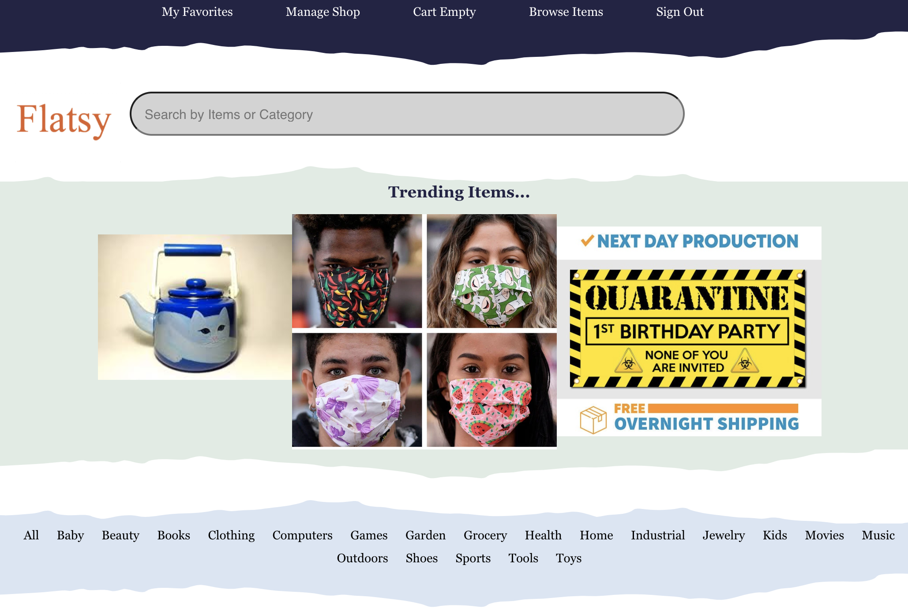
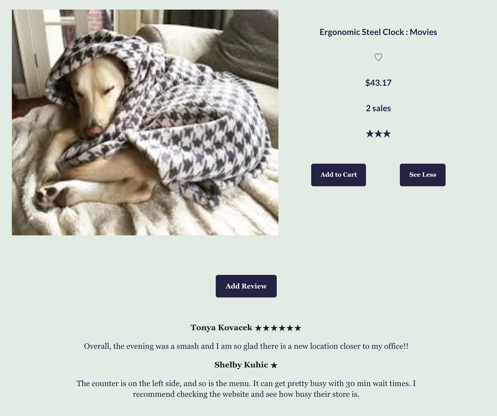
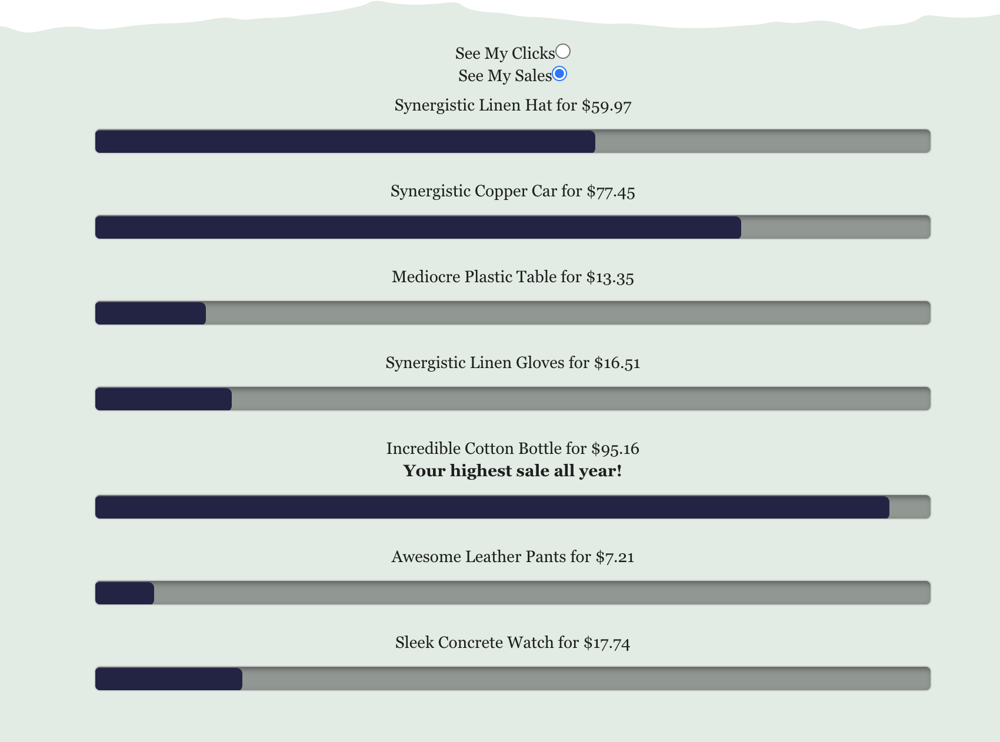
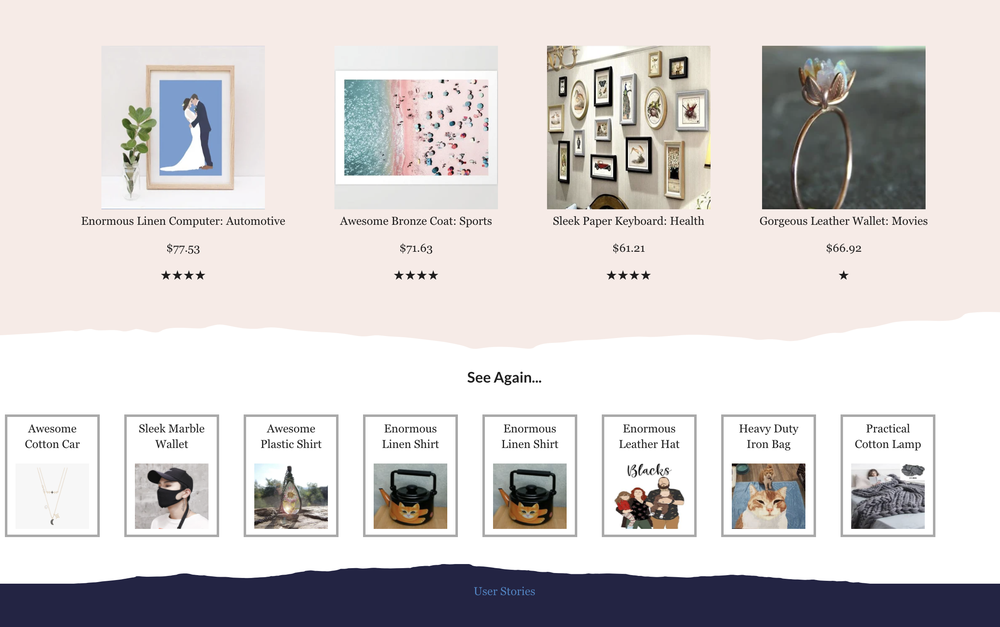
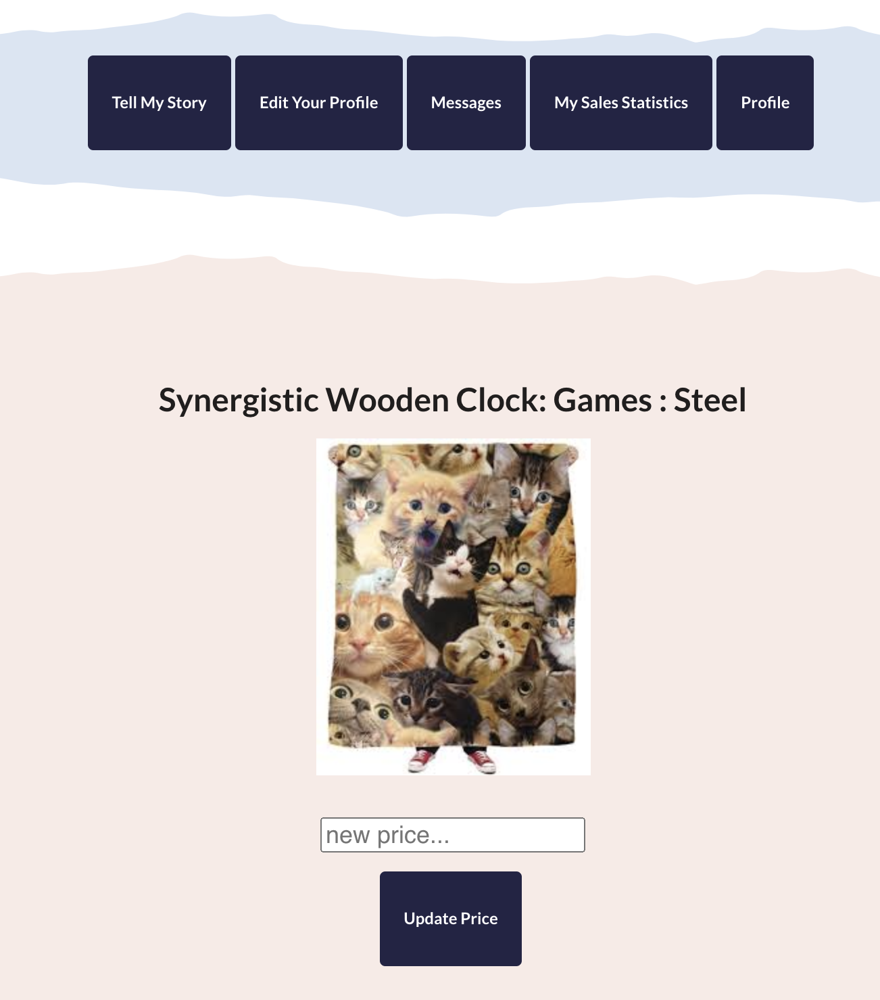

<h2>Flatsy Shops is inspired by Etsy Shops!</h2>

See Home Page Below, Trending Items change every 10 Seconds.

Users can buy items, sell items, rate items, message buyers to ask about items.

Sellers can see their click/sell through statistics.

While a user is signed in they can see a history of the last eight thigs they clicked on.

And of course, sellers can go in and lower the price of anything thats not selling.

